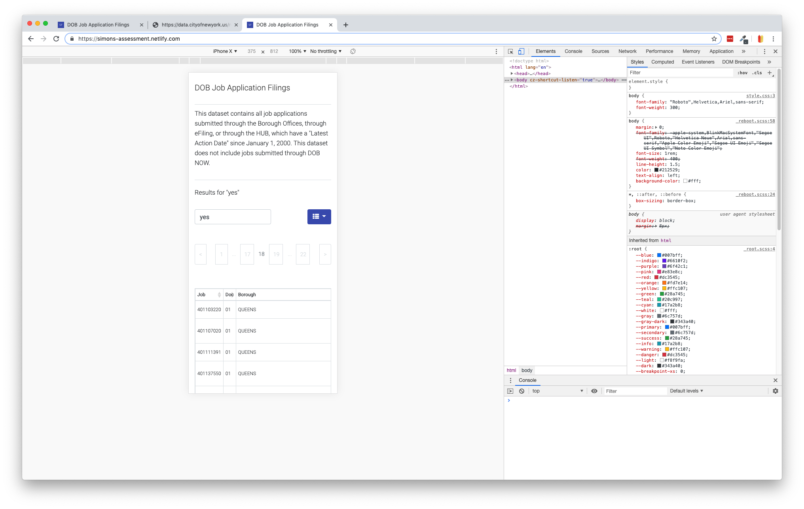
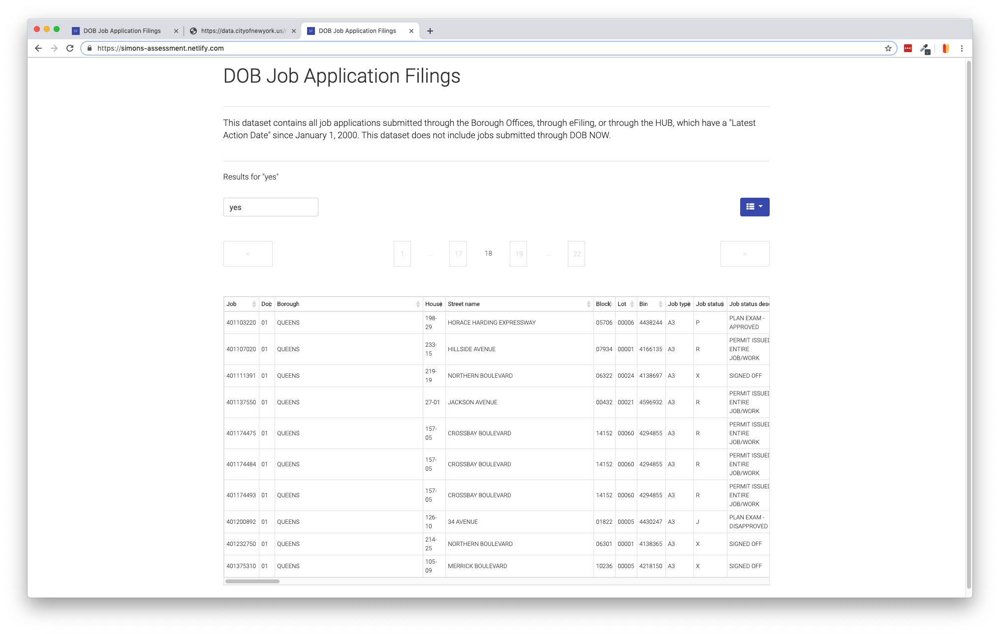

# Simons Foundation Assessment

This DOB Job Application Filings Query Tool allows users to search and sort  housing development data.

The Query Tool can be accessed remotely at https://simons-assessment.netlify.com/.

## Verification Steps

#### Single page results

1. Visit https://simons-assessment.netlify.com/
2. Type "yoyo" into the search box and press the return key
3. Expect a spinner to appear briefly
4. Expect a table to appear with ~3 rows sorted by Job number
5. Expect "Results for' yoyo'" to appear above the search box
6. Scroll or swipe right to see the additional columns
7. Backspace the search box and type "brooklyn"
8. Expect the table to filter to records with Brooklyn (reducing to a 2 rows)
9. Click the column icon* and uncheck `Job`
10. Expect the Job column to become hidden

*Column icon:

#### Multiple page results

1. Reload the page
2. Type "yes" into the search box and and press the return key
3. Expect a spinner to appear briefly
4. Expect a table to appear with ~22 rows sorted by Job number
5. Expect "Results for' yes'" to appear above the search box
6. Click on any of the dimmed pagination boxes to navigate through the results
7. Click on any of the column headers to sort by column (NOTE: return to Page 1 to see the sort order from the beginning)

## Screenshots

### Steps to locally run and test Query Tool

1. Clone this repsitory
2. Open `index.html` in a browser
3. To run tests, install Jest and then run `jest test`(more details on how to install Jest on OSX: https://blog.evantahler.com/testing-javascript-applications-with-selenium-async-await-and-jest-7580ed074f2b)

## Current Design

### Choices

I used the [bootstrap-table](https://bootstrap-table.com) library to reduce developement time by taking advantage of following "out-of-the-box" features:

- respsonive design
- Get data in JSON format using AJAX
- Simple column sorting with a click
- Powerful pagination

It was fairly straightforward to override the bootstrap-table default styles to approximate the look-and-feel of simonsfoundation.org.

### Limitations

Currently , the data size is limited to the default size of the API (the first 1,000 matches in the resultset). If the business requirement of this Query Tool is to manage larger resultsets, I would investigate plugins for processing large data sets in a DOM like https://clusterize.js.org/.

## Simons Foundation Styling

Efforts to mock the styling of Simons Foundation website include:

- Using Roboto Google font to stand in for Univers Next W01
- Using SF favicon
- Using blue and yellow website colors
- Using tall slender look and gray colors for pagination widget

## Future Design

This Query Tool would be an excellent candidate for a single-page React application. I would abstract out the UI widgets like pagination and query inputs into Simons Foundation libary components that could be shared across the organization. And I would make use of [powerful react table libraries](https://techblog.commercetools.com/advanced-data-tables-in-react-dbe33f8345ab?gi=9c6163f9e618) that could support fixed (sticky) as well as scrollable columns to make it easier to compare rows, like this:

## Status and Next Steps

The state of this project is that it has some functionality and styling, but it is not yet an MVP.

Next steps would include:

1. Writing a lot more tests — what's currently here is a simple smoke test to ensure the app loads.
2. Validate search text not to include special characters, etc.
3. Display a `no search results` message instead of an empty table when no records are returned.
4. Manage any potential errors that come back from API.
5. Determine some way to make matched records obvious, perhaps by highlighting the search term.
6. Make clicking on column header to sort return to page 1 if user on higher page.
7. Spinner transition may not be necessary and should be a smoother transition if it remains.
8. Column selection at the very least needs a `select/deselect all` option.
9. Find a way to increase the max-width of the `100` pagination box so it aligns center.
9. Fix various and sundry bugs!
